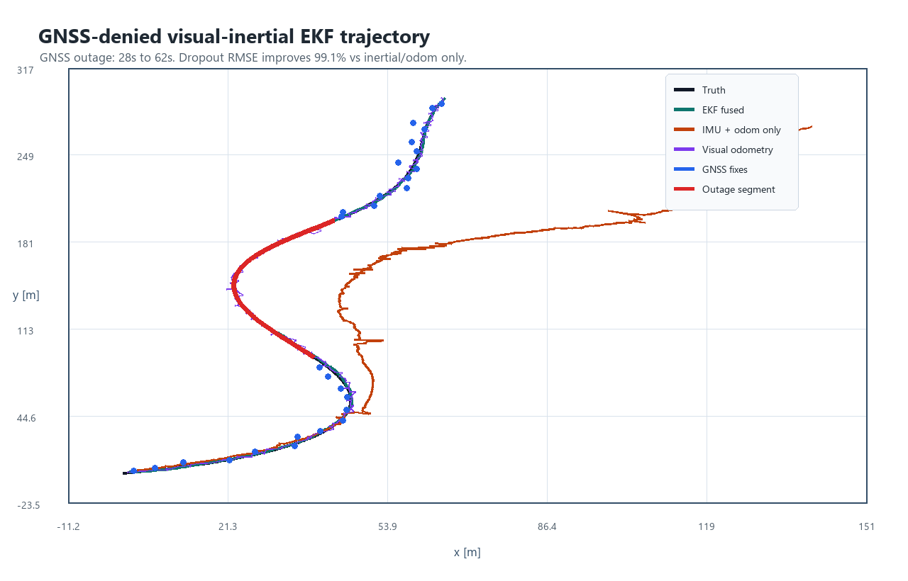
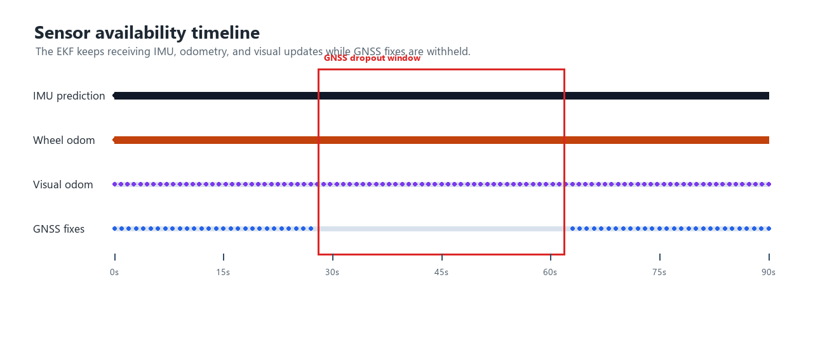
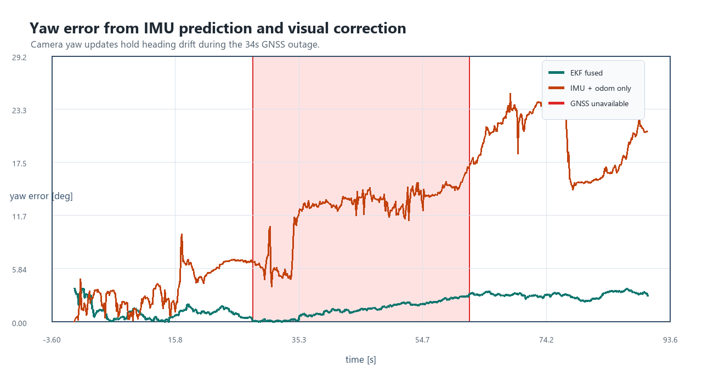

# GNSS-Denied Visual-Inertial Localization

Flagship robotics perception demo for localization when satellite fixes disappear. The project simulates a planar vehicle trajectory, removes GNSS measurements for a configurable outage, and compares a visual-inertial EKF against an IMU plus wheel-odometry dead-reckoning baseline.




## What This Demonstrates

- Simulated GNSS dropout from `28s` to `62s` in a repeatable synthetic route.
- IMU-style prediction with accelerometer and gyro bias drift.
- Wheel-odometry speed correction as a local motion constraint.
- EKF fusion of GNSS fixes, visual-odometry pose corrections, and inertial prediction.
- Trajectory and error plots generated from the actual run, not hand-drawn assets.
- A reproducible Python command and Docker path for reviewers.
- Optional ROS2 C++ wrapper skeleton for moving the estimator toward a live robotics stack.

## Quick Start

```powershell
python -m venv .venv
.\.venv\Scripts\Activate.ps1
python -m pip install -e .
python -m gnss_denied_vio.simulate --seed 7 --output results/example
```

On Linux or macOS:

```bash
python3 -m venv .venv
source .venv/bin/activate
python -m pip install -e .
python -m gnss_denied_vio.simulate --seed 7 --output results/example
```

The run writes:

- `results/example/trajectory_overview.png`
- `results/example/position_error.png`
- `results/example/yaw_error.png`
- `results/example/sensor_timeline.png`
- `results/example/metrics.json`

## Reproducible Result

The committed example was generated with:

```bash
python -m gnss_denied_vio.simulate --seed 7 --output results/example
```

Key metrics from that run:

| Metric | Value |
| --- | ---: |
| GNSS outage | `28s` to `62s` |
| Fused dropout position RMSE | `0.24 m` |
| IMU/odom-only dropout position RMSE | `26.65 m` |
| Dropout improvement | `99.1%` |
| Visual updates | `301` |
| GNSS fixes | `56` |

The sensor timeline shows the estimator still receiving local sensing while GNSS is denied:



Heading drift is also corrected by visual yaw observations:



## How It Works

The EKF state is:

```text
[x, y, vx, vy, yaw, accel_bias_x, accel_bias_y, gyro_bias_z]
```

Prediction uses body-frame accelerometer and yaw-rate measurements, subtracts estimated biases, rotates acceleration into the world frame, and propagates position, velocity, and yaw. The correction steps are:

- GNSS position update when fixes are available.
- Visual-odometry pose update at camera rate.
- Wheel-odometry forward-speed update.

The baseline receives the same IMU prediction and wheel-speed updates but no absolute GNSS or camera pose corrections. That makes the outage behavior easy to inspect.

## Docker

```bash
docker build -t gnss-denied-vio .
docker run --rm -v "$PWD/results:/app/results" gnss-denied-vio
```

The container defaults to the same seed and output directory used by the README screenshots.

## Project Layout

```text
src/gnss_denied_vio/
  config.py       Scenario and sensor parameters
  ekf.py          EKF state propagation and measurement updates
  sensors.py      Truth trajectory plus synthetic IMU, GNSS, VO, and odometry
  simulation.py   End-to-end run loop, metrics, and result persistence
  plots.py        Pillow-based plot rendering for README screenshots
  simulate.py     CLI entry point
ros2/
  gnss_denied_vio_cpp/  Optional ROS2 C++ wrapper node
tests/
  test_simulation.py    Regression tests for outage behavior
```

## ROS2 Wrapper

The optional ROS2 C++ wrapper is in [`ros2/gnss_denied_vio_cpp`](ros2/gnss_denied_vio_cpp). It is intended as a starting point for live topics:

- `/imu/data`
- `/wheel/odom`
- `/visual_odometry`
- `/gnss/pose`
- `/localization/ekf_odom`

## Limitations And Next Steps

- The simulation is 2D and does not model roll, pitch, gravity alignment, camera intrinsics, or feature tracking.
- Visual odometry is generated as a noisy drifting pose stream rather than from image frames.
- The EKF uses fixed measurement covariances; a production system should adapt them based on sensor quality.
- The ROS2 wrapper is intentionally lightweight and should be wired to recorded bags or hardware before being treated as deployment code.
- Good next steps: add KITTI/EuRoC bag playback, expose covariance tuning files, add NEES/NIS consistency checks, and extend the state to full 3D inertial navigation.

---

## Benchmarks

Reproduced with `--seed 7` on the default synthetic scenario (34-second GNSS outage from 28 s to 62 s).

| Metric | EKF (fused) | IMU + odometry only |
|---|---|---|
| Position RMSE during outage | **0.24 m** | 26.65 m |
| Outage duration | 34 s | 34 s |
| Improvement | **99.1%** | — |
| Visual odometry updates | 301 | 0 |
| GNSS fixes (outside outage) | 56 | 56 |

Reproduce:

```bash
python -m venv .venv && source .venv/bin/activate
pip install -e .
python -m gnss_denied_vio.simulate --seed 7 --output results/example
cat results/example/metrics.json
```
