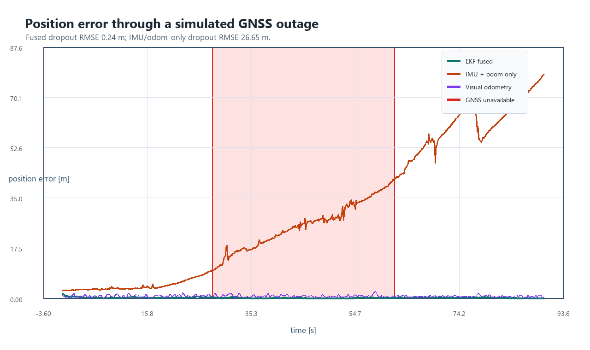

# Algorithm Notes

This note records the modeling choices behind the demo so reviewers can understand what is simulated and what is estimated.

## State And Prediction

The filter estimates planar pose, velocity, heading, and simple inertial biases:

```text
x = [px, py, vx, vy, yaw, bax, bay, bgz]
```

The prediction step rotates body-frame acceleration into the world frame, integrates position and velocity with a constant-acceleration step, and integrates yaw from the measured gyro rate. Accelerometer and gyro biases are modeled as random walks.

## Updates

GNSS, visual odometry, and wheel odometry are intentionally modeled as different observability sources:

- GNSS measures world-frame `x, y`, but is removed during the outage window.
- Visual odometry measures a drifting world-frame pose proxy, including yaw.
- Wheel odometry measures forward speed and keeps the inertial prediction from becoming unconstrained in speed.

## Why The Baseline Drifts

The baseline receives IMU and wheel odometry only. Speed is constrained, but heading is still vulnerable to gyro bias. A small heading error over tens of seconds turns into large lateral position error, which is exactly the failure mode the visual correction is meant to mitigate.

## Result Screenshot



